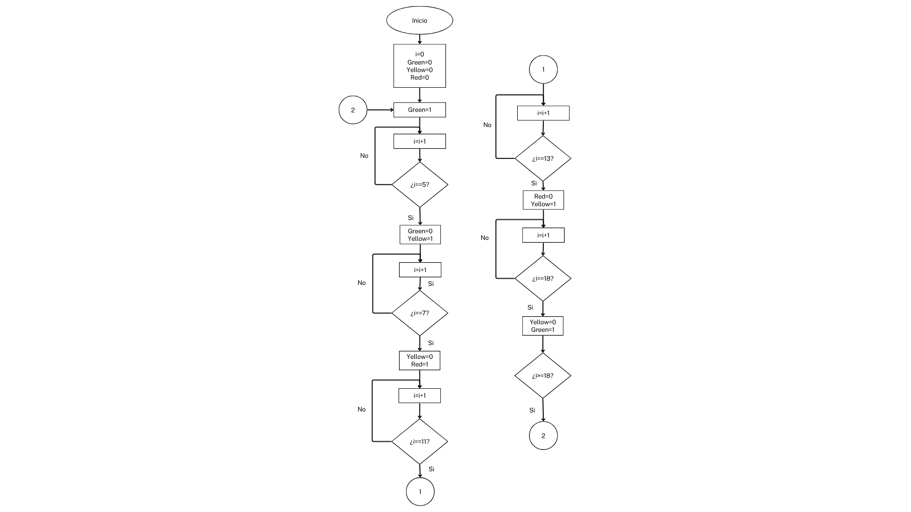
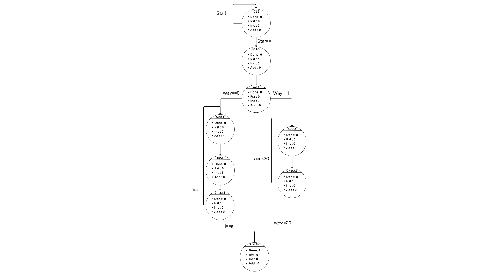
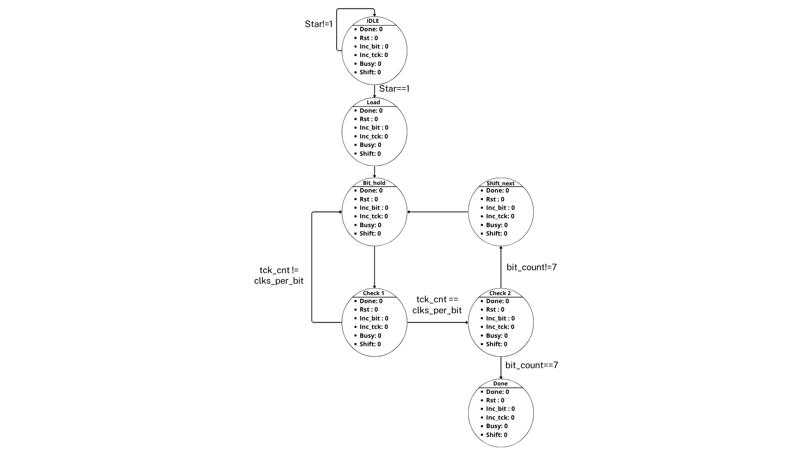

# Laboratorio 00 - Diseño de FSM y ASM en Verilog

## NOMBRES PARTICIPANTES
Jhohan Stiven Rodriguez Rodriguez

Alejandro Brandon Prieto León

Ángel Alirio Rivera Amortegui

## comandos para los ejercicios 

======== EJERCICIO 1 ========

iverilog -g2012 -o src/ejercicio1/semaforo.vvp src/ejercicio1/Semaforo.v src/ejercicio1/Semaforo_TB.v

vvp src/ejercicio1/semaforo.vvp

gtkwave src/ejercicio1/Semaforo_TB.vcd

======== EJERCICIO 2 ========

iverilog -g2012 -o src/ejercicio2/acumulador.vvp src/ejercicio2/acumulador.v src/ejercicio2/tb_acumulador.v

vvp src/ejercicio2/acumulador.vvp

gtkwave src/ejercicio2/acumulador.vcd

======== EJERCICIO 3 ========

iverilog -g2012 -o src/ejercicio3/transmisor.vvp src/ejercicio3/transmisor.v src/ejercicio3/tb_transmisor.v

vvp src/ejercicio3/transmisor.vvp

gtkwave src/ejercicio3/wave.vcd

## Descripción general

En este laboratorio se implementaron y simularon diferentes sistemas digitales secuenciales utilizando máquinas de estados finitos (FSM) y una arquitectura ASM (Algorithmic State Machine).

Los diseños fueron desarrollados en Verilog y verificados mediante simulación utilizando Icarus Verilog y GTKWave.

Cada ejercicio incluye:
- Un módulo de diseño.
- Un testbench para verificar su funcionamiento.
- Generación de archivos `.vcd` para visualizar las señales.
- Evidencia de la simulación en GTKWave.

---

# Ejercicio 1 - Semáforo

## Descripción

Se diseñó una máquina de estados finitos para controlar un semáforo de tres luces: verde, amarillo y rojo.

El sistema utiliza tres estados:

- `S0`: luz verde.
- `S1`: luz amarilla.
- `S2`: luz roja.

La transición entre estados está controlada mediante un contador interno.

## Planteamiento de diseño

Para implementar el semáforo se utilizó una máquina de estados finitos (FSM) de tipo Moore. La FSM está compuesta por tres estados, correspondientes a las tres luces del semáforo: verde, amarillo y rojo.

El estado actual se almacena en un registro y las transiciones se determinan mediante un contador interno. El contador permite establecer el número de ciclos de reloj que permanece activa cada luz.

La secuencia de funcionamiento implementada es:

`S0 → S1 → S2 → S0`

donde:

- `S0` corresponde a la luz verde y permanece durante 5 ciclos.
- `S1` corresponde a la luz amarilla y permanece durante 2 ciclos.
- `S2` corresponde a la luz roja y permanece durante 4 ciclos.

El reset es asíncrono y establece la FSM en el estado inicial `S0` y el contador en cero.

## Descripción del HDL

El módulo `semaforo.v` se divide en tres partes principales:

1. **Registro de estado y contador:** corresponde al bloque secuencial activado por el flanco positivo de `clk` o por el reset. En este bloque se actualizan el estado actual y el contador.

2. **Lógica de estado siguiente:** es un bloque combinacional que determina el siguiente estado dependiendo del estado actual y del valor del contador.

3. **Lógica de salidas:** también es combinacional y determina las señales `verde`, `amarillo` y `rojo` a partir únicamente del estado actual.

Debido a que las salidas dependen exclusivamente del estado actual y no de las entradas externas, la FSM corresponde a una máquina de Moore.

## Resultados y análisis

La simulación permitió comprobar que la FSM recorre correctamente los tres estados en la secuencia esperada:

`S0 → S1 → S2 → S0`

Durante el estado `S0`, la salida `verde` permanece activa durante 5 ciclos de reloj. Posteriormente, la FSM pasa a `S1`, donde se activa `amarillo` durante 2 ciclos. Finalmente, pasa a `S2`, donde se activa `rojo` durante 4 ciclos antes de regresar nuevamente a `S0`.

El contador se reinicia cada vez que ocurre una transición de estado y vuelve a incrementarse mientras la FSM permanece en el mismo estado. Esto permite controlar correctamente la duración de cada luz.

La señal de reset también fue verificada, observándose que el sistema regresa al estado `S0` y reinicia el contador.

Por lo tanto, los resultados obtenidos en GTKWave son coherentes con el comportamiento esperado del diseño.

## Estados

| Estado | Luz activa | Condición de transición |
|--------|------------|-------------------------|
| `S0`   | Verde      | Después de 5 ciclos     |
| `S1`   | Amarillo   | Después de 2 ciclos     |
| `S2`   | Rojo       | Después de 4 ciclos     |

La secuencia de funcionamiento es:

`Verde → Amarillo → Rojo → Verde`

El sistema cuenta con un reset asíncrono que inicializa la FSM en el estado `S0`.

### Diagrama de estados

## Archivos

- `src/ejercicio1/semaforo.v`
- `src/ejercicio1/tb_semaforo.v`
- `src/ejercicio1/semaforo.vcd`

### Testbench

El testbench `tb_semaforo.v` verifica la FSM sin estímulos de entrada adicionales, ya que el semáforo es un sistema de ciclo libre (no tiene una señal `start`): basta con dejar correr el reloj y observar que las salidas se secuencien correctamente.

- **Generación de reloj:** `always #5 clk = ~clk;` genera un reloj de periodo 10 ns (100 MHz).
- **Aplicación de reset:** `rst` se mantiene en `1` durante los primeros 12 ns de simulación (más de un ciclo completo) y luego se libera, garantizando que la FSM parta desde `S0` antes de iniciar la observación.
- **Estímulos:** al no haber entradas de control, el estímulo consiste en dejar correr la simulación 120 ns, tiempo suficiente para recorrer un ciclo completo `S0 (5 ciclos) → S1 (2 ciclos) → S2 (4 ciclos) → S0` (110 ns) y comenzar el siguiente, verificando así las tres transiciones de estado.
- **Generación de VCD:** `$dumpfile("semaforo.vcd"); $dumpvars(0, tb_semaforo);`.
- Un bloque `$monitor` imprime `rst`, `verde`, `amarillo` y `rojo` en cada cambio, como evidencia textual complementaria a la forma de onda.

## Simulación

La simulación permite verificar la secuencia de los tres estados y la duración correspondiente de cada luz.

### Evidencia

# Ejercicio 2 - FSM con datapath: Acumulador secuencial

## Descripción

Se diseñó un sistema secuencial que acumula el valor de entrada `x` durante varios ciclos. El funcionamiento es controlado mediante una FSM y un contador interno.

El sistema posee las siguientes entradas:

- `clk`
- `rst`
- `start`
- `x[3:0]`
- `modo[1:0]`

Las siguientes salidas:

- `acc[5:0]`
- `done`

La FSM está compuesta por cuatro estados:

- `IDLE`
- `LOAD`
- `ADD`
- `DONE`

## Planteamiento de diseño

Para este ejercicio se diseñó una FSM con un datapath encargado de realizar las operaciones aritméticas del acumulador.

La FSM controla el proceso mediante cuatro estados:

`IDLE → LOAD → ADD → DONE`

En `IDLE`, el sistema permanece esperando la activación de `start`. Cuando `start` se activa, la FSM pasa a `LOAD`, donde se inicializan el acumulador y el contador.

Posteriormente, en el estado `ADD`, se realiza la suma de `x` y se actualiza el acumulador. El número de sumas depende del modo seleccionado mediante `modo[1:0]`.

La lógica de control determina cuándo debe finalizar la operación:

- Para `modo = 00`, la operación termina después de tres sumas.
- Para `modo = 01`, la operación termina después de cuatro sumas.
- Para `modo = 10`, la operación termina cuando la siguiente suma produciría un valor mayor que 20.

Una vez cumplida la condición correspondiente, la FSM pasa al estado `DONE`, donde se activa la señal de finalización.

## Descripción del HDL

El módulo `acumulador.v` utiliza un registro de estado para controlar la secuencia de operación y un contador interno para determinar el número de sumas realizadas.

El bloque secuencial se encarga de actualizar:

- El estado actual.
- El acumulador `acc[5:0]`.
- El contador de operaciones `contador[2:0]`.

El bloque de lógica de siguiente estado analiza el estado actual y las condiciones de operación para determinar la transición correspondiente.

La entrada `modo[1:0]` permite seleccionar dinámicamente el comportamiento del acumulador sin modificar el código del módulo. De esta forma, el mismo diseño puede realizar las tres operaciones solicitadas.

La salida `done` se genera a partir del estado `DONE`, indicando que la operación seleccionada ha terminado.

## Resultados y análisis

La simulación permitió comprobar el funcionamiento de los tres modos de operación del acumulador.

Para `modo = 00` y `x = 3`, el acumulador realizó la secuencia:

`0 → 3 → 6 → 9`

Después de realizar las tres sumas, la FSM pasó al estado `DONE` y se activó la señal `done`.

Para `modo = 01` y `x = 3`, se obtuvo:

`0 → 3 → 6 → 9 → 12`

En este caso se realizaron cuatro sumas antes de activar `done`.

Para `modo = 10` y `x = 3`, el acumulador obtuvo:

`0 → 3 → 6 → 9 → 12 → 15 → 18`

La siguiente suma produciría `21`, por lo que la condición `acc + x > 20` provoca la finalización de la operación. De esta manera, el acumulador termina con `acc = 18` sin superar el límite establecido.

Las señales observadas en GTKWave permiten verificar además la secuencia de estados, el incremento del contador y la actualización del acumulador.

Un aspecto importante del diseño es que el valor de `x` es una entrada del módulo. Por lo tanto, el sistema puede recibir diferentes valores durante una demostración sin necesidad de modificar el código HDL. Los valores utilizados en la simulación corresponden a casos de prueba seleccionados para verificar cada modo de operación.

Los resultados obtenidos son coherentes con las condiciones de transición definidas para la FSM y cumplen con el comportamiento esperado del acumulador.

## Modos de operación

El sistema permite seleccionar tres formas diferentes de acumulación mediante la entrada `modo`.

### Modo 0 - Sumar 3 veces, la simulacion esta hecha con el ejemplo del numero x=3

Cuando:

`modo = 00`

El sistema suma el valor `x` tres veces.

Por ejemplo, para `x = 3`:

`0 → 3 → 6 → 9`

Al finalizar las tres sumas, se activa `done`.

### Modo 1 - Sumar 4 veces

Cuando:

`modo = 01`

El sistema suma el valor `x` cuatro veces.

Por ejemplo, para `x = 3`:

`0 → 3 → 6 → 9 → 12`

Al finalizar las cuatro sumas, se activa `done`.

### Modo 2 - Acumular sin superar 20

Cuando:

`modo = 10`

El sistema continúa sumando `x` mientras la siguiente suma no haga que el acumulador supere 20.

Por ejemplo, para `x = 3`:

`0 → 3 → 6 → 9 → 12 → 15 → 18`

La siguiente suma produciría 21, por lo que el sistema termina manteniendo:

`acc = 18`

En este modo el acumulador nunca supera el valor 20.

## Archivos

- `src/ejercicio2/acumulador.v`
- `src/ejercicio2/tb_acumulador.v`
- `src/ejercicio2/acumulador.vcd`

### Testbench

El testbench `tb_acumulador.v` prueba los tres modos de operación de forma secuencial, usando siempre `x = 3` para poder comparar directamente el resultado esperado en cada modo.

- **Generación de reloj:** periodo de 10 ns (`always #5 clk = ~clk;`).
- **Aplicación de reset:** `rst = 1` durante los primeros 12 ns; luego se libera y la FSM queda en `IDLE` lista para recibir `start`.
- **Estímulos:** se ejecutan tres pruebas consecutivas, cada una activando `start` por un ciclo (sincronizado con `@(negedge clk)`) y esperando `done` antes de continuar:
  - `modo = 00` → suma `x` 3 veces.
  - `modo = 01` → suma `x` 4 veces.
  - `modo = 10` → suma `x` hasta que la siguiente suma superaría 20.
  
  Entre cada prueba se dejan 2 ciclos de margen antes de cambiar de modo y volver a activar `start`.
- **Generación de VCD:** `$dumpfile("acumulador.vcd"); $dumpvars(0, tb_acumulador);`.
- Un bloque `$monitor` reporta `rst`, `start`, `x`, `modo`, `acc` y `done` en cada cambio, permitiendo seguir la evolución del acumulador ciclo a ciclo en consola.

## Simulación

La simulación permite verificar los diferentes estados de la FSM, el funcionamiento del acumulador, el contador de sumas y la activación de `done`.

### Evidencia

# Ejercicio 3 - ASM: Transmisor serial de 8 bits

## Descripción

Se diseñó una arquitectura ASM para implementar un transmisor serial síncrono de 8 bits.

El sistema recibe un dato de 8 bits mediante `data_in` y lo transmite de manera serial a través de `tx`, comenzando por el bit menos significativo (LSB first).

El sistema utiliza el parámetro:

`CLKS_PER_BIT = 8`

El reloj utilizado en la simulación tiene un periodo de 10 ns, por lo que cada bit permanece durante:

`8 × 10 ns = 80 ns`

## Planteamiento de diseño

Para implementar el transmisor serial se utilizó una arquitectura ASM (Algorithmic State Machine), compuesta por una unidad de control basada en una FSM y un datapath encargado de almacenar, desplazar y temporizar el dato.

La unidad de control está formada por cinco estados:

`IDLE → LOAD → BIT_HOLD → SHIFT_NEXT → DONE`

El diseño utiliza un registro de desplazamiento de 8 bits para almacenar el dato de entrada. La transmisión se realiza comenzando por el bit menos significativo (LSB first).

Para controlar la duración de cada bit se utiliza un contador de temporización `tick_cnt`. Con `CLKS_PER_BIT = 8`, cada bit permanece estable durante 8 ciclos del reloj.

Además, se utiliza el contador `bit_count` para determinar cuántos bits han sido transmitidos y detectar cuándo debe finalizar la transmisión.

El proceso comienza cuando `start` es activado. La FSM carga el dato en el registro de desplazamiento, transmite cada bit durante el tiempo establecido y desplaza el registro para seleccionar el siguiente bit. Después de transmitir los ocho bits, se genera un pulso de `done` y el sistema regresa al estado de espera.

## Descripción del HDL

El módulo `transmisor.v` está dividido en tres bloques principales.

### Bloque secuencial

El bloque secuencial actualiza el estado y los registros internos en cada flanco positivo del reloj. También implementa el reset asíncrono.

Los principales registros utilizados son:

- `state`: almacena el estado actual de la ASM.
- `shift_reg[7:0]`: almacena el byte que será transmitido.
- `bit_count[2:0]`: cuenta los bits transmitidos.
- `tick_cnt`: controla la duración de cada bit.

Durante el estado `LOAD`, el dato de entrada se carga en `shift_reg` y los contadores se inicializan.

Durante `BIT_HOLD`, `tick_cnt` controla el tiempo durante el cual se mantiene el bit actual en `tx`.

Durante `SHIFT_NEXT`, el registro de desplazamiento se desplaza una posición hacia la derecha y se incrementa `bit_count`.

### Lógica de siguiente estado

La lógica combinacional determina las transiciones entre los cinco estados.

En `IDLE`, la FSM espera `start`.

En `BIT_HOLD`, la transición a `SHIFT_NEXT` ocurre cuando se alcanza el valor correspondiente del contador de temporización.

En `SHIFT_NEXT`, si `bit_count = 7`, se considera transmitido el último bit y se pasa a `DONE`. De lo contrario, se regresa a `BIT_HOLD` para transmitir el siguiente bit.

### Lógica de salidas

Las salidas `tx`, `busy` y `done` dependen del estado actual.

En `IDLE`, la línea `tx` permanece en nivel alto y `busy` y `done` permanecen inactivos.

En `BIT_HOLD`, `tx` toma el valor de `shift_reg[0]` y `busy` permanece activo.

En `DONE`, `done` se activa durante un ciclo y `busy` vuelve a cero.

## Resultados y análisis

La simulación se realizó utilizando `CLKS_PER_BIT = 8` y un reloj de periodo de 10 ns. Por lo tanto, cada bit transmitido permanece durante:

`8 × 10 ns = 80 ns`

Se realizaron dos transmisiones para verificar el funcionamiento del transmisor.

Para el primer caso se utilizó:

`data_in = A5 = 1010 0101`

Como la transmisión se realiza LSB first, la secuencia observada en `tx` fue:

`1 → 0 → 1 → 0 → 0 → 1 → 0 → 1`

Para el segundo caso se utilizó:

`data_in = 3C = 0011 1100`

La secuencia transmitida fue:

`0 → 0 → 1 → 1 → 1 → 1 → 0 → 0`

Las señales observadas en GTKWave permiten comprobar que cada bit permanece estable durante el número de ciclos establecido. También se observa el desplazamiento progresivo de `shift_reg` y el incremento de `bit_count` hasta alcanzar el último bit.

La señal `busy` permanece activa durante el proceso de transmisión y vuelve a cero cuando esta termina. Por su parte, `done` se activa durante un ciclo en el estado `DONE`, indicando la finalización de la transmisión.

El comportamiento observado confirma que el registro de desplazamiento, el contador de bits y el contador de temporización trabajan coordinadamente con la FSM. Por lo tanto, la implementación cumple con la secuencia de control y la temporización establecidas para el transmisor serial.

## Entradas y salidas

### Entradas

- `clk`
- `rst`
- `start`
- `data_in[7:0]`

### Salidas

- `tx`
- `busy`
- `done`

## Estados de la ASM

La arquitectura está compuesta por cinco estados:

### `IDLE`

Estado de espera.

- `busy = 0`
- `tx = 1`
- `done = 0`

El sistema permanece esperando hasta recibir un pulso de `start`.

### `LOAD`

Se carga el dato de entrada en el registro `shift_reg`.

También se inicializan:

- `bit_count = 0`
- `tick_cnt = 0`

Durante este estado `busy` permanece activo.

### `BIT_HOLD`

Mantiene el bit actual en la salida `tx` durante el número de ciclos definido por `CLKS_PER_BIT`.

El bit transmitido corresponde a:

`shift_reg[0]`

Por lo tanto, la transmisión se realiza LSB first.

### `SHIFT_NEXT`

Se desplaza el registro:

`shift_reg = shift_reg >> 1`

y se incrementa `bit_count`.

Si todavía quedan bits por transmitir, el sistema regresa a `BIT_HOLD`.

Cuando se ha transmitido el octavo bit, el sistema pasa a `DONE`.

### `DONE`

Indica que la transmisión terminó.

- `done = 1`
- `busy = 0`
- `tx = 1`

Este estado permanece durante un ciclo y posteriormente el sistema regresa a `IDLE`.

## Datapath

El transmisor utiliza los siguientes registros internos:

- `shift_reg[7:0]`: almacena y desplaza el dato que se está transmitiendo.
- `bit_count[2:0]`: cuenta los ocho bits transmitidos.
- `tick_cnt`: controla la duración de cada bit.

## Pruebas realizadas

Se realizaron dos transmisiones diferentes:

### Transmisión 1: `A5`

El valor hexadecimal:

`A5 = 1010 0101`

Al transmitirse LSB first, la secuencia observada en `tx` es:

`1 → 0 → 1 → 0 → 0 → 1 → 0 → 1`

### Transmisión 2: `3C`

El valor hexadecimal:

`3C = 0011 1100`

Al transmitirse LSB first, la secuencia observada en `tx` es:

`0 → 0 → 1 → 1 → 1 → 1 → 0 → 0`

Los bits permanecen estables durante 8 ciclos de reloj cada uno.

## Verificación en GTKWave

En GTKWave se observaron las siguientes señales:

- `clk`
- `rst`
- `start`
- `state`
- `data_in`
- `shift_reg`
- `bit_count`
- `tick_cnt`
- `tx`
- `busy`
- `done`

La simulación permite comprobar:

- La transmisión correcta de los 8 bits.
- La transmisión LSB first.
- Una duración de 8 ciclos de reloj por bit.
- La activación de `busy` durante la transmisión.
- La activación de `done` durante un ciclo al finalizar cada transmisión.
- El desplazamiento correcto de `shift_reg`.
- El conteo de los bits mediante `bit_count`.

## Archivos

- `src/ejercicio3/transmisor.v`
- `src/ejercicio3/tb_transmisor.v`
- `src/ejercicio3/wave.vcd`

## Testbench

El testbench `tb_transmisor.v` verifica dos transmisiones completas de un byte, comprobando la carga del dato, el envío LSB-first y la señal de finalización.

- **Generación de reloj:** periodo de 10 ns (`always #5 clk = ~clk;`).
- **Aplicación de reset:** `rst = 1` durante los primeros 12 ns antes de iniciar cualquier transmisión.
- **Estímulos:**
  - Primera transmisión con `data_in = 8'hA5` (`1010 0101`): se activa `start` por un ciclo sincronizado con `@(negedge clk)` y se espera `done`.
  - Segunda transmisión con `data_in = 8'h3C` (`0011 1100`), tras 2 ciclos de margen desde el fin de la anterior.
  
  Ambas transmisiones ejercitan los cinco estados de la ASM (`IDLE → LOAD → BIT_HOLD → SHIFT_NEXT → DONE`) y permiten confirmar que `busy` se mantiene activo durante el envío y que `done` se activa un ciclo al finalizar cada una.
- **Generación de VCD:** `$dumpfile("wave.vcd"); $dumpvars(0, tb_transmisor);`.
- Un bloque `$monitor` imprime `rst`, `start`, `data_in`, `tx`, `busy` y `done` en cada cambio, útil para verificar manualmente la secuencia de bits transmitida.

## Evidencias

### Primera vista de GTKWave

### Segunda vista de GTKWave

---

# Conclusiones

En este laboratorio se implementaron diferentes sistemas digitales secuenciales utilizando máquinas de estados finitos y una arquitectura ASM.

El primer ejercicio permitió trabajar con una FSM y un contador para controlar la secuencia temporal de un semáforo.

En el segundo ejercicio se integró una FSM con un datapath para controlar un acumulador secuencial con diferentes modos de operación.

En el tercer ejercicio se implementó una ASM completa para un transmisor serial de 8 bits, integrando control, datapath y temporización explícita.

Las simulaciones realizadas mediante Icarus Verilog y GTKWave permitieron verificar el comportamiento de los diseños y comprobar que las transiciones de estado, contadores, registros y señales de salida funcionan de acuerdo con las especificaciones.
